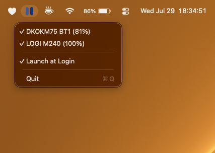

# BlueBars 

Small MacOS menubar tool to show the battery status of connected bluetooth devices. It is **really** simple and works a charm.

## What do the BlueBars mean?

| What's up? | What do I see? |
|------------|----------------|
| Much power | Dark blue      |
| Less power | Lighter blue   |

## Building it yourself

Requirements: macOS 13+, Xcode Command Line Tools (`xcode-select --install`).

1. Clone the repo.
2. Create a local code-signing certificate (one-time, see below) so the app keeps its Bluetooth/Input Monitoring permissions across rebuilds.
3. Update `SIGN_IDENTITY` in `build_app.sh` to match your certificate's name.
4. Run `./build_app.sh` — builds the Swift package and produces a signed `BlueBars.app`.
5. `open BlueBars.app` to launch it. macOS will ask for Bluetooth permission on first run.

### Why you need your own certificate

Ad-hoc signing (`codesign -s -`) generates a new identity every time the binary changes, so macOS silently drops the Bluetooth/Input Monitoring permission on every rebuild. Signing with a stable local certificate keeps the same identity across builds, so permissions stick.

Create one via Keychain Access > Certificate Assistant > Create a Certificate (Identity Type: **Self Signed Root**, Certificate Type: **Code Signing**), then set it to "Always Trust" for code signing. Good walkthrough: [How to create a code signing certificate in macOS](https://www.simplified.guide/macos/keychain-cert-code-signing-create).

If you rename or resign under a new identity, macOS will treat the app as new and ask for permissions again — that's expected, just re-approve them in System Settings > Privacy & Security.

## Downloading a release

MacOS Gatekeeper will flag this application as coming from an unidentified developer on first launch. This is because I am not paying Apple to have me run my own apps. To open it anyway:

- Right-click the app > **Open** > confirm **Open**, or
- Terminal: `xattr -cr BlueBars.app` to drop the quarantine flag, then open normally.
